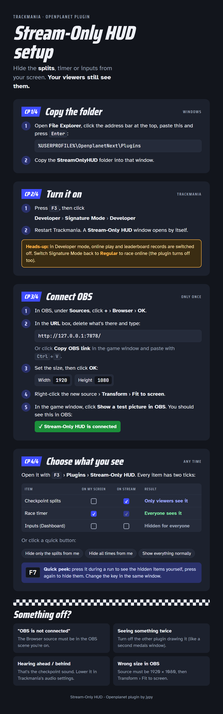

# Stream-Only HUD

An Openplanet plugin for Trackmania. Hide the splits, timer, inputs and more from your own
screen while your viewers still see them on stream.

| Element | Source |
|---|---|
| Checkpoint splits | game (`UIModule_Race_Checkpoint`) |
| Race timer | game (`UIModule_Race_Chrono`) |
| Checkpoint & lap counter | game (`UIModule_Race_LapsCounter`) |
| Records panel | game (`UIModule_Race_Record`) |
| Medals & personal best | drawn by this plugin |
| Inputs (Dashboard) | the Dashboard plugin's pad (gamepad or keyboard) |
| Gear & RPM (Dashboard) | the Dashboard plugin's gearbox |
| Speed (Dashboard) | the Dashboard plugin's speedometer |

---

## Streamer guide

Text version of the guide

#### 1. Install the plugin (in Trackmania)

1. Press **F3**.
2. Click **Plugin Manager** at the top, then **Open manager**.
3. Search **Stream-Only HUD** and click **Install**.

A setup window opens by itself.

Installing from a folder or <code>.op</code> file instead

1. Open File Explorer, paste `%USERPROFILE%\OpenplanetNext\Plugins` in the address bar and
   press Enter.
2. Copy the `StreamOnlyHUD` folder (or `StreamOnlyHUD.op` from the
   [releases](https://github.com/jypy933/tm-stream-only-hud/releases)) into that window.
3. In Trackmania press **F3 > Developer > Signature Mode > Developer**, then restart the game.

Developer mode switches off online play and leaderboard records. Switch Signature Mode
back to **Regular** to race online (the plugin stops loading until it's installed from the
Plugin Manager). The picture above follows this route.

#### 2. Connect it to OBS (once)

1. In OBS, in the **Sources** box, click **+** and choose **Browser**. Click **OK**.
2. In Trackmania's setup window, click **Copy OBS link** (it's `http://127.0.0.1:7878/`).
3. Back in OBS, click in the **URL** box, delete what's there and press **Ctrl+V**.
4. Set **Width 1920** and **Height 1080**. Click **OK**.
5. Right-click the new source > **Transform** > **Fit to screen**.

In Trackmania's window, click **Show a test picture in OBS**. A green "connected" banner
should appear in OBS, and the window says **OBS is connected**.

#### 3. Choose what you see

Open the window any time: **F3 > Plugins > Stream-Only HUD**. Every item has two ticks:

| On my screen | On stream | Result |
|---|---|---|
| ✔ | ✔ (locked) | Everyone sees it |
| ✘ | ✔ | Only viewers see it |
| ✘ | ✘ | Hidden for everyone |

"On my screen but not on stream" isn't possible: OBS records your screen, so anything you
can see is on stream too.

- Or click a quick choice: **Hide only the splits from me**, **Hide all times from me**,
  **Show everything normally**.
- **Show/hide key:** press **F7** during a run to see the hidden items yourself, and again
  to hide them. Your ticks don't change. Change the key (or turn it off) under the list.
- The inputs, gear and speed boxes from the **Dashboard** plugin are in the same list.
- **Medals panel corner on stream** picks where the medals panel appears for viewers.

#### If something's wrong

- **The window says "OBS is not connected"**: the Browser source must be in the OBS scene
  you're using. Redo step 2 in that scene.
- **Viewers see something twice**: another plugin is drawing the same thing (for example
  a second medals window). Turn that plugin's window off.
- **You can still hear if you're ahead or behind**: that's the checkpoint sound. Turn it
  down in Trackmania's audio settings.
- **"Port is already in use"**: another program uses the same connection. Pick another port
  in Openplanet **Settings > Stream-Only HUD > Advanced**, then copy the new link into OBS.
- **Things look shifted or too small in OBS**: the source must be 1920 x 1080, then
  **Transform > Fit to screen**. The test picture warns you when the size is wrong.

---

## For developers

### How it works

- **Hiding native HUD:** every native module has a root frame `frame-global` whose
  position the game never touches. The plugin moves it off-screen. The game keeps running
  the module, so the plugin reads exactly what it would have shown (PB diff, colours, ranks).
- **Dashboard parts:** another plugin's drawing is part of the game picture, so it can't
  be split between screen and stream. When "On my screen" is unticked, the plugin switches
  that Dashboard part off through Openplanet's settings API (and switches it back on when
  re-ticked or when this plugin unloads). The overlay redraws it from live car data
  (`VehicleState`) using Dashboard's own position, size, colours and pad type.
- **Showing on stream:** a localhost-only HTTP server (`127.0.0.1:7878`) serves a
  full-screen overlay page and a live event stream (`/events`): HUD state 10x per second,
  car inputs up to 60x per second so the pad moves smoothly. In OBS it's a 1920x1080 Browser
  Source; each element is drawn at the position the game uses, so nothing needs placing.
- **Feedback:** the plugin sees when OBS is listening, so the in-game window shows
  "OBS is connected" and warns if hidden elements aren't reaching viewers. "Show a test
  picture in OBS" displays a green banner and sample elements on stream for 30 seconds.
- **Show/hide key:** temporarily treats stream-only elements as "on my screen"; the
  overlay stops drawing them meanwhile so viewers never see them twice.

### Building and publishing

Unsigned plugins only load in Openplanet's Developer mode, which turns on School Mode
(no online play, no leaderboard records), so the plugin has to be published and signed
for normal use:

1. Run `pack.ps1` to build `dist\StreamOnlyHUD.op` (or download it from the latest
   [release](https://github.com/jypy933/tm-stream-only-hud/releases)).
2. On openplanet.dev, sign in, create a new plugin, upload the `.op` and ask for it to be
   signed. The Openplanet team reviews it.
3. Once approved, it installs from the in-game Plugin Manager and updates arrive the same way.

### Testing locally

Copy the folder into `C:\Users\<you>\OpenplanetNext\Plugins\`, switch Openplanet to
**Developer > Signature Mode > Developer** (needs Club access), then
**Developer > Load plugin**. Check `Openplanet.log` for compile errors.

### Limits

- The checkpoint **sound** still plays (higher when ahead, lower when behind).
- If Nadeo renames a module or its control IDs, that element simply shows normally again
  in game until the IDs are updated in `src/Elements.as`.
- Other Openplanet plugin windows can't be hidden from the player but shown on stream:
  they are drawn into the game picture. That's why the medals panel is built in and the
  Dashboard parts are redrawn. Dashboard's gradient fills aren't copied (solid colours only).

## License

MIT. See [LICENSE](LICENSE).
