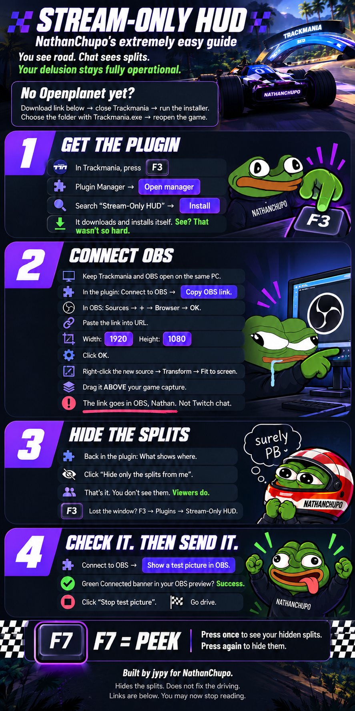

[Download Openplanet for Trackmania](https://openplanet.dev/download/next) · [Browse Openplanet plugins](https://openplanet.dev/plugins) · [Releases](https://github.com/jypy933/tm-stream-only-hud/releases) · [License (MIT)](LICENSE)

*Openplanet installation is available once the plugin is approved and listed.*
